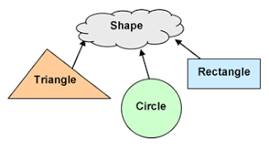

# Kotlin Essentials (Inheritance and Class types)
---
The Kotlin assignment has two components:
- Part I: Practice with Inheritance.
- Part II: Practice with Class types. 

## Part I - Practice with Inheritance. note !! (you MUST add comment in each line explaining your code for good practice)!! this is requiared 
---


To apply the Inheritance concept, create one superclass called `Shape` that has two properties called `shapeName` and `shapeColor`, and also has two functions one called `info()` that return name and color of shape and the other one called `computeArea()` that has no parameter, and return Double data type.

On the other hand, there are three subclasses that inherit from the superclass called `Triangle`, `Rectangle`, and `Circle`. Each subclass has different properties according to it. For example, Rectangle has `width` and `height` properties, Triangle has `base` and `height` properties, and Circle has `pi` and `radius` properties.

You need to change the body of `computeArea()` in each subclass to make sure this function will compute the area according to the subclass' name. For example, `computeArea()` in the `Triangle` subclass will calculate the triangle area, and so on.

```sh
Formulas to compute area:
`Circle area = pi times the radius squared (A = π*r²)`
`Rectangle area = height times width  (A = h * w)`
`Triangle area = half of height times base (A = (h * b)/2 )`
```

fun main() {
val Triangle =Triangle
val Rectangle=Rectangle
val Circle=Circle
/*
استدعيت الكلاس واضفت له val
*/
Shape.info()

}
/*
سويت كلاس الام عشان اورث منه ويحتوي على fun info
*/
open class Shape(Name: String, color: String):String {

    fun info() {
        println("$Name,$color")

    }
    open fun ComputeArea(): Double {
        return(0.0)

    }

}
/*
هنا اضفت ثلاثة كلاسات للاشكال المطلوبة وطلبت ان القيمة تكون double لحساب المساحة ويرجعلي القيمة وايضا اضفت قيم للارقام واللون لكل شكل
*/
class Triangle : Shape() {
override fun ComputeArea(): Double {
return ("h * b)/2")

    }
    val h = 15.3
    val b = 10.3
    val shapeColore = orange
}


class Rectangle : Shape() {
override fun ComputeArea(): Double {
return ("h * w")

    }
    val h = 12.2
    val w = 12.2
    val shapeColore =blue

}

class Circle : Shape() {
override fun ComputeArea(): Double {


        return (" pi*r²")

    }
    val pi = 14.4
     val shapeColore = green

}

/*
part 2
* The most basic use case for enum classes is the implementation of type-safe enums but data
  It is not unusual to create classes whose main purpose is to hold data.

*  object keyword
   */


## Part II - Practice with Class types. (optional)
---
### Open Questions:
- What is the difference between `enum classes` and `data classes`?
- Which one of the `object` keyword ways can be used for the inheritance concept? 


